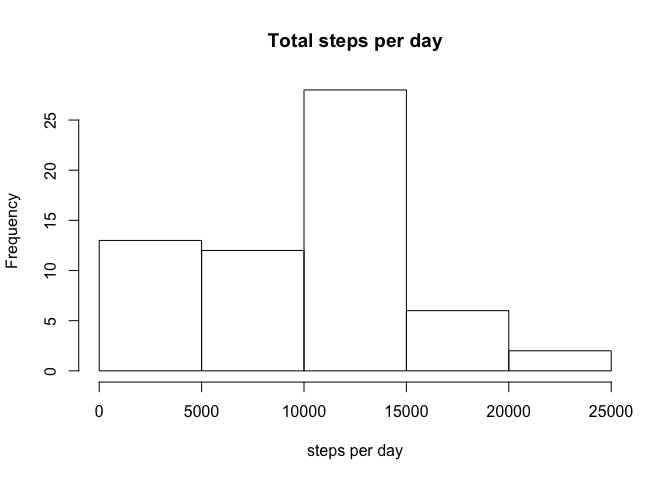

# Reproducible Research: Peer Assessment 1


## Loading and preprocessing the data
<<<<<<< HEAD
* Reading data


```r
#Reading data
unzip("activity.zip")
data <- read.csv("./activity.csv")
```

##Question 1: What is mean total number of steps taken per day?

* A histogram of the total number of steps taken per day


```r
# calculate the steps per day
stepsperday <- tapply(data$steps, data$date, sum, na.rm = T)
# histogram
hist(stepsperday, main = "Histogram", xlab = "steps per day")
```

 

* The mean number of steps taken per day is 9354.2295082
* The median number is 10395.


```r
mean(stepsperday)
```

```
## [1] 9354.23
```

```r
median(stepsperday)
```

```
## [1] 10395
```


## Question 2: What is the average daily activity pattern?

* Calculating average activity pattern


```r
# calculate the average steps per interval
avgsteps<- tapply(data$steps, data$interval, mean, na.rm = T)
# plot average daily activity
plot(levels(as.factor(data$interval)), avgsteps, type = "l", main = "Average daily activity pattern", xlab = "interval", ylab = "average steps per interval")
```

 

* The interval 104, on average across all the days in the dataset, contains the maximum number of steps.


```r
which(avgsteps == max(avgsteps))
```

```
## 835 
## 104
```


##Question3: Imputing missing values

* The total number of rows with NAs is 2304.


```r
sum(is.na(data$steps))
```

```
## [1] 2304
```


* Fill in the missing values, by replacing NA values with the median for that interval. 


```r
# create a function for replacing NA with median
replaceNAwithMedian <- function(x){ 
    m <- median(x, na.rm = TRUE) 
    x[is.na(x)] <- m 
    x 
} 
```

* Creating a new dataset that is equal to the original dataset but with the missing data filled in.


```r
# replicate data into data1
data1 <- data
# apply the replacing function for steps in each interval
data1$steps <- ave(data$steps, data$interval, FUN = replaceNAwithMedian)
```

* Making a histogram of the total number of steps taken each day and calculating and reporting the mean and median total number of steps taken per day.


```r
stepsPerDayMedianNA <- tapply(data1$steps, data1$date, sum, na.rm = T)
hist(stepsPerDayMedianNA, main = "Total steps per day", xlab = "steps per day")
```

 

```r
mean(stepsPerDayMedianNA)
```

```
## [1] 9503.869
```

```r
median(stepsPerDayMedianNA)
```

```
## [1] 10395
```
The mean value has changed from 9503.8688525
The mean value has changed from 10395
The mean value has changed from 9354.2295082 to 9503.8688525. The total daily number of steps **increased** after NA values being replaced with median values per interval.

## Question4: Are there differences in activity patterns between weekdays and weekends?

* Creating a new "weekday" factor variable in the dataset with levels “weekday” and “weekend”.


```r
#converting date format, 0-6 represents Sunday through Saturday
data1$datenew <- as.POSIXlt(data1$date)
data1$weekday <- ifelse(data1$datenew$wday == 0 | data1$datenew$wday == 6, "weekend", "weekday")
```

* Making a time series plot with the 5-minute interval on the x-axis and the average number of steps taken, averaged across all weekday days or weekend days on the y-axis.


```r
library(lattice)
xyplot(steps ~ interval | weekday, data1, type = "a", layout = c(1, 2), xlab = "interval", ylab = "number of steps", ylim = c(min(avgsteps) - 10, max(avgsteps) + 10))
```

 
=======


## What is mean total number of steps taken per day?


## What is the average daily activity pattern?


## Imputing missing values


## Are there differences in activity patterns between weekdays and weekends?
>>>>>>> 80edf39c3bb508fee88e3394542f967dd3fd3270
